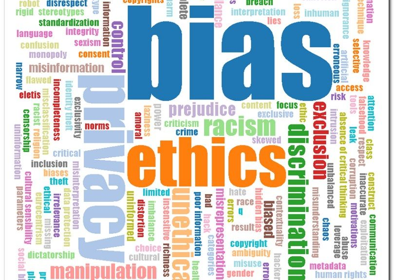

# Bias and Exclusivity in the Digital Humanities

As the digital humanities continues to grow and develop, we must take into consideration how the field and its technologies are inherently biased--there is no such thing as a "neutral tool". We must acknowledge that this field and its tools developed interdependently with major cultural and social shifts throughout history. The influence of world views and power systems of inequality can be seen in the field's structure, such as the institutions and the leading practitioners, but also in the very infrastructure of technologies, such as UNIX. How do we tackle this issue that is engrained in the digitial humanities? This is the challenge that the authors Tara McPherson, Moya Bailey, Kim Gallon, Denise Pacheco, and Veronica Nelly Velez address in each of their articles. Part of the solution is brining the topic of bias and exclusivity to the forefront of the conversations in the digital humanities. We must continue to recognize how these tools and the field are not free from bias, but instead are influenced by individual's cultural contexts, identities, and worldviews. We must also center marginalized people in this field and continue to include more diverse voices so that developements and conversations moving forward include their perspective from the very beginning. Ultimately, a structural reimagining of the digital humanities and the humanities is needed to push for reform in the field and challenge its normative practices. 

Image from: https://arturmarques.com/wp/2019/09/22/intro-to-digital-humanities-day-6-lesson-1-5/ 
